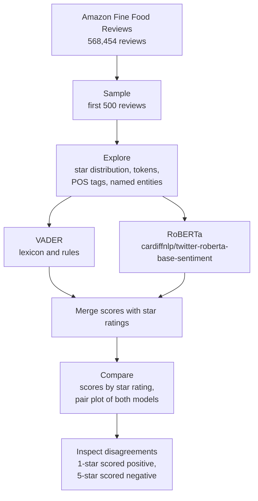

# Sentiment Analysis: VADER and RoBERTa

Scores the sentiment of Amazon food reviews two ways, with a rule-based lexicon and with a pretrained transformer, then compares where the two agree with the star rating and where they are fooled.

`Python` `NLTK` `Hugging Face Transformers` `pandas` `seaborn`

## Why this exists

A lexicon model counts sentiment-bearing words. A transformer reads the sentence. Putting both on the same reviews, next to the rating the customer gave, shows what context buys you: sarcasm, negation, and reviews that use positive words to say something negative.

## Pipeline



| Step | Detail |
| --- | --- |
| Data | Review text and 1 to 5 star score. A 500-review sample keeps transformer inference quick on a laptop |
| NLTK basics | Tokenisation, part-of-speech tagging and named-entity chunking on an example review |
| VADER | `SentimentIntensityAnalyzer` gives negative, neutral, positive and compound scores per review |
| RoBERTa | Logits from the pretrained model are passed through softmax to get negative, neutral and positive probabilities |
| Comparison | Bar plots of each score against star rating, and a pair plot of all six scores coloured by rating |
| Error analysis | The most positive-scored 1-star reviews and the most negative-scored 5-star reviews, for each model |
| Shortcut | The same task in two lines with the Transformers `pipeline` API |

## What to look for

- **The bar plots**: how VADER's compound, positive, neutral and negative scores move as the star rating goes from 1 to 5.
- **The pair plot**: how cleanly each model separates low ratings from high ones when both sets of scores sit side by side.
- **The error analysis**: the reviews each model gets most wrong. These tend to be the ones where tone and vocabulary disagree, such as sarcasm, or a complaint followed by praise.

This notebook is a qualitative comparison. It does not compute an accuracy figure for either model.

## Running it

```bash
pip install pandas numpy matplotlib seaborn nltk transformers torch scipy tqdm jupyter
jupyter notebook Sentiment_analysis.ipynb
```

The notebook reads `Reviews.csv` from its own folder. The dataset is not included in the repository. Amazon Fine Food Reviews is available on Kaggle. The first run downloads the NLTK resources and the RoBERTa weights.

## Next steps

- Map star ratings to negative, neutral and positive labels and report accuracy and macro F1 for both models.
- Run on a sample stratified by star rating instead of the first 500 rows, since the ratings in this dataset are heavily skewed toward 5 stars.
- Fine-tune the transformer on review text, since the checkpoint used here was trained on tweets.

---

Built by [Yogdeep Benchimath](https://github.com/Yogdeep2004). More work on the [portfolio](https://deepwork-systems.vercel.app/).
